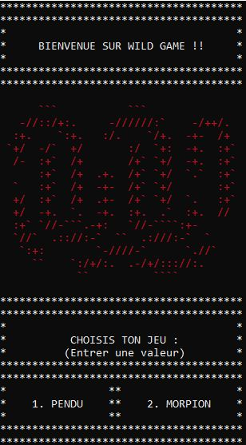
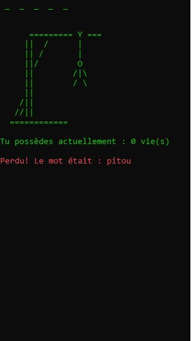
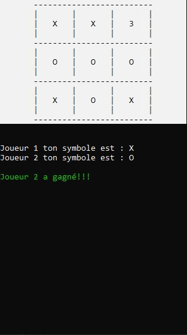

# Wild Code School
 

## Project 2 : Mini Games
This is the second project of our cursus, started in September 2020 in Toulouse.

Create a Tic Tac Toe and a Hangman Game with C#.

## Screenshots :

## Authors
- Colas Durcy 
- Fabien Desnoues 
- Maïlys Dumas 

# Minigames-CSharp
